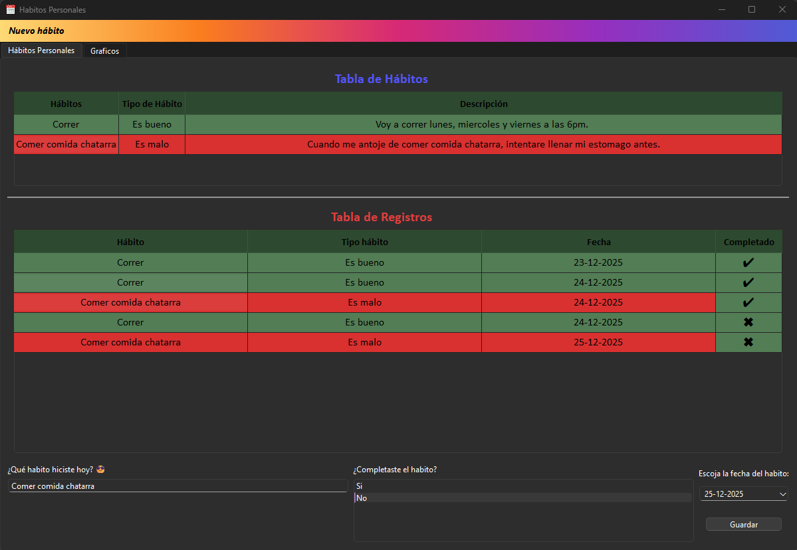
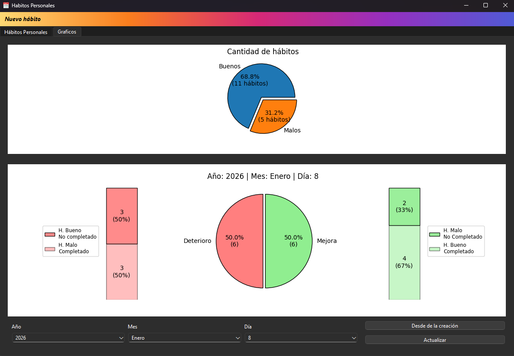
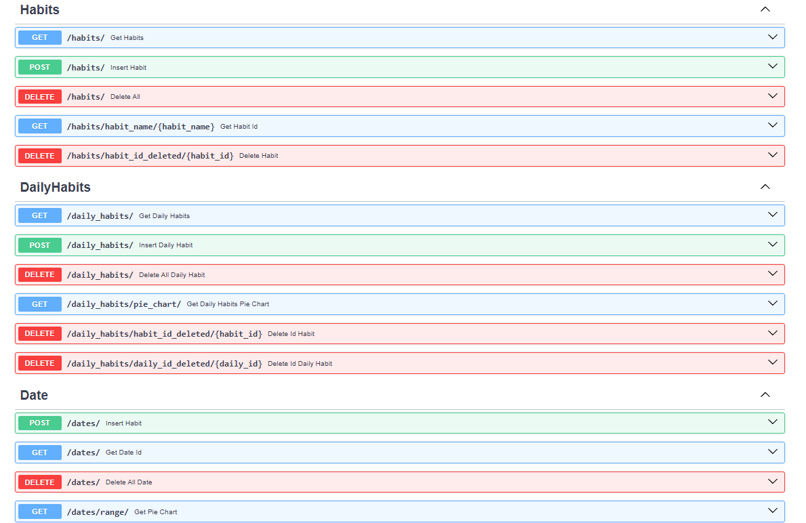

# Proyecto - Habitos Personales - FastAPI

### ¿De qué trata?
Es una versión mejorada, en el sentido de que ahora se utiliza una API como capa de comunicación entre el backend (PostgreSQL) 
y el frontend (PySide6). Tiene lo mismo que el proyecto anterior, la diferencia que ahora está en inglés las variables
para el backend, pero para el interfaz está en español.

1. Crear hábitos como: Correr, ver redes sociales, lavarse los dientes. 
2. Crear la descripción del hábito: Salir a correr los lunes, miércoles y viernes a las 6pm.
3. El tipo de hábito: Si es bueno o malo. Correr bueno. Ver tiktok antes de dormir: Malo.

Este ejemplo es completamente subjetivo, ya que cada uno tiene sus prioridades. 

Además, al crear el hábito, están los registros de esos hábitos, en donde solo seleccionas el hábito creado
y se rellena en la entrada automáticamente, para luego escoger si lo completaste o no, junto con agregar el día en 
que lo hiciste. 

Los gráficos, por el momento hay dos:
1. El gráfico que muestra la cantidad de hábitos: buenos / malos.
2. El gráfico que muestra la mejora y deterioro personal
   1. La mejora es: hábitos buenos que completaste y hábitos malos que no completaste.
   2. El deterioro es: hábitos malos que completaste y hábitos buenos que no completaste.

Por último están los botones de eliminar todos los hábitos y eliminar todo los registros, por si quieres empezar de cero! 
También están los botones de eliminar tanto como el hábito o el registro, individualmente. 

## Estado del proyecto
Proyecto en desarrollo – versión 1.0 funcional.

## Documentación
- Tabla de elementos: https://doc.qt.io/qt-6/qtablewidget.html
- Botones: https://doc.qt.io/qt-6/qpushbutton.html
- Ventana principal: https://doc.qt.io/qt-6/qmainwindow.html
- Widgets: https://doc.qt.io/qt-6/qwidget.html
- Ventana de diálogo: https://doc.qt.io/qt-6/qdialog.html
- Entrada de texto en una línea: https://doc.qt.io/qt-6/qlineedit.html
- Entrada de texto: https://doc.qt.io/qt-6/qtextedit.html
- Etiqueta: https://doc.qt.io/qt-6/qlabel.html
- Lista de elementos: https://doc.qt.io/qt-6/qlistwidget.html  | https://doc.qt.io/qt-6/qcombobox.html
- Insertar un formato al texto: https://doc.qt.io/qt-6/qfont.html
- Calendario: https://doc.qt.io/qt-6/qcalendar.html
- Estilo y colores: https://doc.qt.io/qt-6/stylesheet-syntax.html
- Mensaje parar alertar al usuario: https://doc.qt.io/qt-6/qmessagebox.html
- Definir un espacio para cada widget: https://doc.qt.io/qt-6/qgridlayout.html
- Menú: https://doc.qt.io/qt-6/qmenu.html
- Agregar icono: https://doc.qt.io/qt-6/qicon.html
- Agregar una acción, ej: eliminar: https://doc.qt.io/qt-6/qaction.html
- Agregar pestaña: https://doc.qt.io/qt-6/qtabwidget.html
- Gráficos: https://matplotlib.org/stable/

## Ejecución
1. Clona el repositorio
2. Crear archivo `.env`, deje un `.env.example` como referencia. 
3. Ejecuta el comando `docker compose up --build` para levantar backend y base de datos
4. Luego en la terminal del proyeto, cambias a la carpeta frontend `cd frontend` y ejecutas el comando `pip install -r requirements.txt`
5. Ejecutas `python main.py `
6. Listo. =) 

